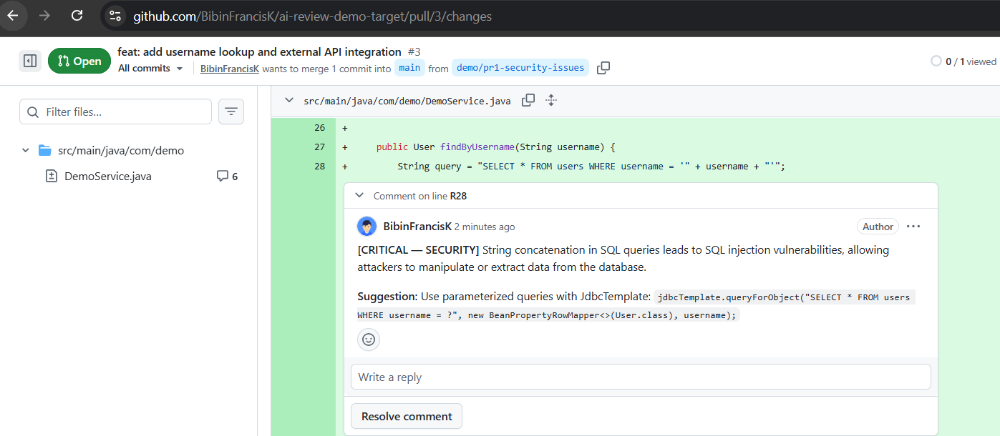
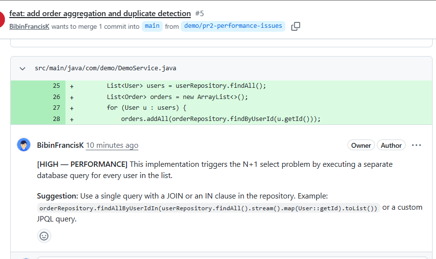
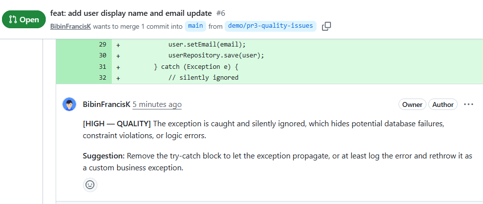

# AI Code Review Agent

> Automatically reviews GitHub PRs using LLM analysis — posts inline comments for bugs, security vulnerabilities, and performance anti-patterns.

[](https://github.com/BibinFrancisK/ai-code-review-agent/actions/workflows/ci.yml)
[](target/site/jacoco/index.html)
[](https://hub.docker.com/r/bibinfrancisk/ai-code-reviewer)


---

## Demo

Bot catches a SQL injection vulnerability inline on a real GitHub PR:



> Full walkthrough: [docs/screenshots/demo.gif](docs/screenshots/demo.gif)

---

## Architecture

```
    GitHub PR Event (open / synchronize)
        │
        ▼ POST /webhook/github
┌─────────────────────────────────────────────────────────┐
│                                         Spring Boot App │
│  WebhookController                                      │
│       │ (validates HMAC-SHA256, responds 202 in <1s)    │
│       ▼                                                 │
│  PullRequestService  ──► GitHubApiService               │
│       │ (fetches PR diff/ files)                        │
│       ▼                                                 │
│  DiffChunkerService                                     │
│       │ (splits files into ≤150-line chunks)            │
│       ▼                                                 │
│  LLMReviewService  ──► LLM API                          │
│       │ (generates review)                              │
│       ▼                                                 │
│  ReviewPublisherService ──► GitHub Review API           │
│       │ (posts inline PR comments)                      │
│       ▼                                                 │
│  ReviewRepository ──► PostgreSQL                        │
│         (persists review history)                       │
└─────────────────────────────────────────────────────────┘
        │
        ▼  GET /api/reviews  
          (retrieve review history)
```

---

## What It Detects

| Category    | Examples                                                |
|-------------|---------------------------------------------------------|
| Security    | SQL injection, hardcoded secrets, OWASP Top 10 etc.     |
| Bugs        | Null pointer risks, race conditions, off-by-one etc.    |
| Performance | N+1 queries, O(n²) loops, unnecessary allocations etc.  |
| Quality     | Swallowed exceptions, SOLID violations, dead code  etc. |

---

## How It Works

1. GitHub sends a webhook on PR open or push
2. `WebhookSignatureFilter` verifies the `X-Hub-Signature-256` HMAC header — returns 401 on mismatch
3. `PullRequestService` hands off to an `@Async` thread — webhook returns 202 in < 1s
4. PR diff is fetched via GitHub API and split into ≤ 150-line chunks
5. Each chunk is reviewed by Google Gemini and returned as structured JSON
6. Inline review comments are posted directly on the PR via the GitHub Review API
7. Review and all comments are persisted to PostgreSQL

---

## Tech Stack

| Layer       | Technology                                      |
|-------------|-------------------------------------------------|
| Framework   | Java 17, Spring Boot 3.x                        |
| LLM         | Google Gemini (via LangChain4j)                 |
| Database    | PostgreSQL + Flyway                             |
| Deployment  | AWS EC2 t2.micro (CDK + GitHub Actions)         |
| Auth        | GitHub OAuth token introspection                |
| API Docs    | Springdoc OpenAPI / Swagger UI                  |
| Metrics     | Micrometer (via Spring Boot Actuator)           |

---

## Performance

Measured across 3 demo PRs (security, performance, and quality issue sets):

| Metric               | Value                                                        |
|----------------------|--------------------------------------------------------------|
| Average review time  | ~19s for PRs up to ~40 diff lines                            |
| Max PR size tested   | ~40 diff lines (supports up to 150 lines per LLM chunk)      |
| Issue distribution   | ~29% security / ~52% bugs & performance / ~19% quality       |
| False positive rate  | ~0% (0 of 21 comments on correct code)                       |

---

## API

The review history API is protected by GitHub OAuth token introspection. Pass any valid GitHub PAT as a Bearer token.

```bash
# Set your host
# HOST=http://localhost:8080       
# HOST=http://<ec2-ip>:8080 

# List all reviews (paginated)
curl -H "Authorization: Bearer <your-github-pat>" $HOST/api/reviews

# Get a specific review with all comments
curl -H "Authorization: Bearer <your-github-pat>" $HOST/api/reviews/{id}

# All reviews for a repo
curl -H "Authorization: Bearer <your-github-pat>" $HOST/api/reviews/repo/{owner}/{repo}

# Reviews for a specific PR
curl -H "Authorization: Bearer <your-github-pat>" $HOST/api/reviews/pr/{owner}/{repo}/{prNumber}
```

Full interactive docs at `$HOST/swagger-ui.html`.

---

## Local Setup

See [docs/LOCAL-DEV.md](docs/LOCAL-DEV.md) for the full local development guide.

---

## Deployment

The app is deployed to AWS EC2 via TypeScript CDK and GitHub Actions. See [docs/CDK.md](docs/CDK.md) for one-time setup prerequisites and how the deployment pipeline works.

Every push to `main` triggers `cdk deploy` — CloudFormation diffs and updates the EC2 instance automatically.

---

## Screenshots

### SQL injection caught (PR 1 — Security)


### N+1 query flagged (PR 2 — Performance)


### Swallowed exception flagged (PR 3 — Quality)

